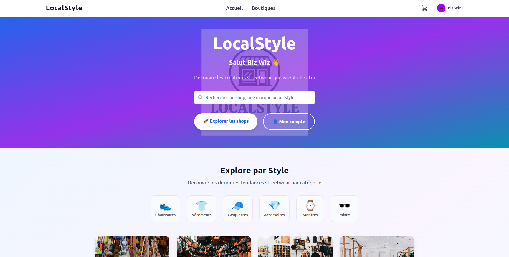
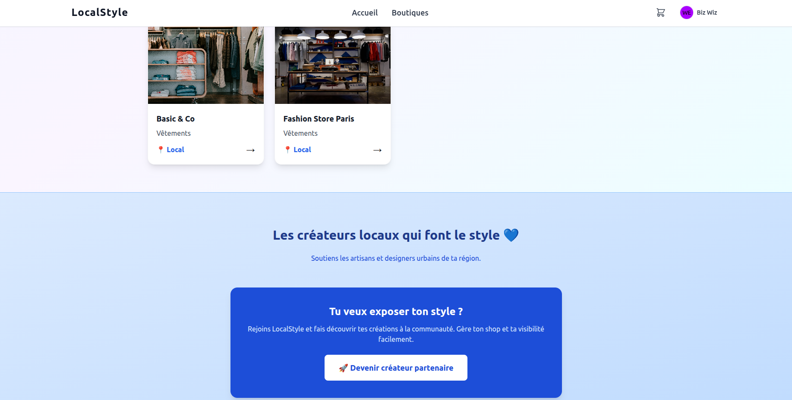

## Sommaire
- [Sommaire](#sommaire)
- [Présentation du projet](#présentation-du-projet)
  - [Contexte et ambitions](#contexte-et-ambitions)
- [Objectifs du projet](#objectifs-du-projet)
- [Stack technique](#stack-technique)
  - [Technologies utilisées](#technologies-utilisées)
  - [Explications des technologies](#explications-des-technologies)
- [Architecture du projet](#architecture-du-projet)
- [5. Lancement du projet](#5-lancement-du-projet)
- [6. Illustration](#6-illustration)
- [Évolutions possibles](#évolutions-possibles)
  - [Court terme – Phase de prototypage](#court-terme--phase-de-prototypage)
  - [Moyen terme – Phase d’expansion](#moyen-terme--phase-dexpansion)
  - [Long terme – Phase de scale](#long-terme--phase-de-scale)
  - [Note sur la géolocalisation](#note-sur-la-géolocalisation)

---

## Présentation du projet

Le projet **Ydays 2025** a pour objectif de développer une **plateforme e-commerce locale** permettant aux commerçants et artisans d’une région de vendre leurs produits en ligne tout en favorisant le commerce de proximité.

L’application se veut **rapide, moderne, responsive et simple d’utilisation**, aussi bien pour les utilisateurs que pour les administrateurs.

### Contexte et ambitions

Ce projet s’inscrit dans le cadre de la formation **Ynov**, où les étudiants doivent concevoir et développer un projet concret sur une période donnée (Ydays).  
Au-delà de l’aspect académique, notre ambition est de créer une **plateforme évolutive** pouvant, à terme, être déployée à plus grande échelle.

L’objectif à long terme est de développer un **écosystème complet de commerce local**, inspiré de plateformes comme **Uber Eats**, mais dédié aux commerces de proximité.

Nous cherchons à :

- Expérimenter des **technologies modernes** (React, Node.js, Supabase) dans un contexte réel  
- Valider le **concept auprès des commerçants locaux**  
- Évoluer vers un **modèle économique durable** avec des contrats commerçants  
- **Scaler la plateforme** progressivement vers plusieurs villes et régions  

Le projet est conçu pour être **modulaire et évolutif**, permettant l’ajout progressif de fonctionnalités comme la géolocalisation avancée, les systèmes de paiement et une application mobile.

---

## Objectifs du projet

- Créer une application web complète (front-end et back-end)  
- Permettre la consultation, l’ajout au panier et l’achat de produits locaux  
- Mettre en avant la proximité géographique entre acheteurs et commerçants  
- Fournir une interface ergonomique et fluide, adaptée à tous les écrans  
- Garantir la sécurité et la fiabilité des données utilisateurs  
- Mettre en place un **système de coursiers** (type Uber Eats)  
- Intégrer un **filtrage géographique** pour afficher les commerces proches  

---

## Stack technique

### Technologies utilisées

**Front-end :**
- React  
- Tailwind CSS  

**Back-end :**
- Node.js (Express.js)  
- Supabase (base de données & authentification)

| Front-end                                                                                                      | Back-end                                                                                                             |
| -------------------------------------------------------------------------------------------------------------- | -------------------------------------------------------------------------------------------------------------------- |
|  React               |  Node.js (Express.js)                               |
|  Tailwind CSS |  Supabase |

### Explications des technologies

**React**  
Framework JavaScript moderne pour créer des interfaces dynamiques et modulaires, idéal pour les Single Page Applications (SPA). Ce choix permet un apprentissage collaboratif au sein de l’équipe.

**Tailwind CSS**  
Framework CSS utilitaire permettant de concevoir rapidement des interfaces modernes, cohérentes et faciles à maintenir.

**Node.js / Express.js**  
Serveur JavaScript rapide et scalable, choisi pour son intégration naturelle avec React et Supabase, ainsi que pour l’expérience préalable de certains membres du groupe.

**Supabase**  
Solution back-end basée sur PostgreSQL intégrant API et authentification, facilitant la gestion sécurisée des utilisateurs et des données.

---

## Architecture du projet

Organisation générale du projet :

```text
Projet-Ydays-2025/
├── backend/
│   ├── controllers/
│   ├── routes/
│   ├── server.js
│   └── supabaseClient.js
├── frontend/
│   ├── src/
│   │   ├── components/
│   │   ├── context/
│   │   ├── hooks/
│   │   ├── pages/
│   │   └── services/
│   └── vite.config.js
├── package-lock.json
└── README.md

```

## 5. Lancement du projet

**Côté Front-end :**

```bash
cd frontend
npm install
npm run dev
```

**Côté Back-end :**

```bash
cd backend
npm install
npm start
```

---

## 6. Illustration

*(Ajouter ici vos captures d’écran ou diagrammes du projet)*

Capture d'ecrans Interface Utilisateur :




---

## Évolutions possibles

### Court terme – Phase de prototypage

- Intégration de **Google Maps** pour la localisation des commerces et le calcul des distances  
- Ajout des champs **latitude / longitude** pour chaque commerce  
- Mise en place d’un **filtrage géographique intelligent**  
- Intégration de **Stripe** pour les paiements sécurisés  
- Interface marchand enrichie :  
  - analytics  
  - gestion des stocks  
  - suivi des commandes  

---

### Moyen terme – Phase d’expansion

- Déploiement **multi-villes**  
- Mise en place de **contrats avec les commerçants**  
- Développement d’une **application mobile** avec React Native (iOS / Android)  
- Système de livraison avancé avec **suivi en temps réel**

---

### Long terme – Phase de scale

- Création d’une **marketplace complète** dédiée au commerce local  
- Mise à disposition d’une **API publique** pour des intégrations externes  
- **Internationalisation** de la plateforme  
- Utilisation de l’**intelligence artificielle** :
  - recommandations personnalisées  
  - prévisions de ventes  

---

### Note sur la géolocalisation

La stratégie d’implémentation de Google Maps sera progressive :

1. Ajout des coordonnées géographiques lors de la création d’un commerce  
2. Calcul des distances entre utilisateurs et commerces  
3. Visualisation cartographique  
4. Optimisation des zones de livraison et expansion multi-villes  

---

Ce projet, initié dans le cadre des **Ydays Ynov**, a pour vocation de poser les bases d’une **plateforme de référence pour le commerce local**, combinant **innovation technologique** et **impact social positif**.
